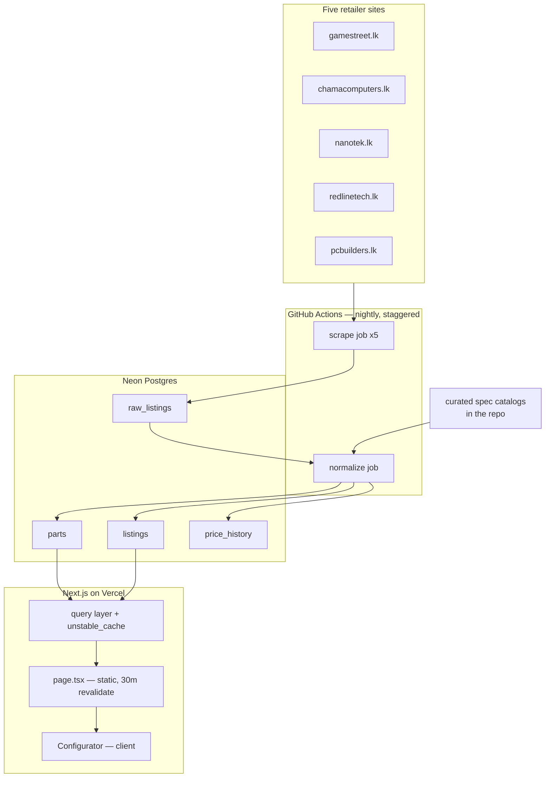

# Architecture

## What this is for

A buyer in Sri Lanka cannot use PCPartPicker to buy a PC. It knows every part
ever made and none of the local prices, so a compatible build on it is often a
build nobody here stocks. This project inverts that: a small catalogue of only
what four Colombo retailers actually have, with the compatibility checking that
makes the catalogue usable.

Two things follow from that premise and shape everything below.

**Mixing shops is the point.** No single retailer carries a whole build at good
prices. Every part therefore carries *all* the shops selling it, and the build
total is a sum across shops rather than a basket at one.

**Compatibility answers must be deterministic.** A wrong "your PSU is fine" is a
build that doesn't boot or a part that burns. So the rules are pure functions
over plain objects, with no model in the path — the one place a model is used is
matching messy listing titles at ingest, where a mistake costs a missing row
rather than a dead motherboard.

## The shape of it

Three runtimes, deliberately: the site never scrapes, and the scrapers never
serve a request. A retailer changing its markup can break tonight's ingest
without touching what a visitor sees.

## Module map

| Path | Responsibility |
|---|---|
| `src/scrapers/` | One module per retailer. `pcbuilders.ts` reads a JSON API; the rest parse HTML. Emits `ScrapedRow` and nothing more — no part matching, no spec parsing. `tyno.ts` is a shared fetch flow for the two Tyno storefronts; their parsers stay separate. |
| `src/lib/http.ts` | The only HTTP client. Serialises requests per host, 1.5s floor, bounded retries. |
| `src/pipeline/scrape.ts` | Runs a scraper, sanity-checks the result, lands rows in `raw_listings`. |
| `src/normalize/extract.ts` | Deterministic title → part identity for all seven categories. Returns `null` freely. |
| `src/normalize/ai.ts` | The only model call in the codebase. Chooses among supplied candidates; never recalls specs. |
| `src/catalog/platforms.ts` | Chipset → socket + memory generation. 33 rows cover every board and CPU in the catalogue. |
| `src/catalog/*-specs.ts` | Curated, source-cited specs: 54 GPUs, 86 CPUs, 5 PSUs. |
| `src/catalog/apply.ts` | Pushes curated specs onto `parts`, folds alias part_ids. |
| `src/pipeline/normalize.ts` | Resolves raw rows to parts, writes `listings` and `price_history`. |
| `src/compat/rules.ts` | Pairwise checks. Pure. `pass` / `fail` / `warn` / `unknown`. |
| `src/compat/build.ts` | Build-level evaluation, candidate ranking, next-slot suggestion. Pure. |
| `src/queries/build.ts` | Loads the whole catalogue for the configurator, cached 30 min. |
| `src/app/` | The public configurator, category pages and part pages. |
| `src/app/admin/` | Authenticated operations area — sync health, catalogue summary, and the spec-gap editor. The only place the app writes. |
| `src/lib/admin-auth.ts` | One password, HMAC-signed cookie. `requireAdmin()` for pages, `assertAdmin()` for actions. |
| `src/proxy.ts` | Keeps anonymous traffic off `/admin`. An optimisation, not the boundary. |
| `src/catalog/gaps.ts` | Which spec fields a rule needs, and which nulls are correct rather than missing. |
| `src/catalog/overrides.ts` | Applies hand-entered values on top of everything the pipeline produced. |

`src/queries/parts.ts` is no longer imported by anything — it served the earlier
part-detail UI and is dead code pending removal.

## Data model

Four tables (`src/db/schema.ts`):

- **`parts`** — one row per canonical part, keyed by a synthesised `part_id`
  (`rtx-5070-12gb`, `ryzen-5-5600`). Category-specific columns are nullable;
  which apply is decided by `category`. This is the compatibility model.
- **`raw_listings`** — every scraped row, verbatim, never mutated except to
  stamp `normalized_at`. This is what makes ingest reprocessable.
- **`listings`** — one row per `(part_id, shop)`, overwritten each run. Current
  price and stock.
- **`price_history`** — append-only, one row per `(part_id, shop, day)`.

The `part_id` is the join between a shop's marketing text and a compatibility
fact, and getting it wrong is the failure mode that matters: too coarse and two
different cards share a price, too fine and one card's prices split across
entries. Several fields are folded into it deliberately — memory capacity on
GPUs, efficiency tier on PSUs, architecture on workstation cards — each after a
real collision. See [decisions](decisions.md#part-identity).

## Rendering and caching

The page is **statically prerendered with a 30-minute revalidate**. The entire
catalogue (1,046 parts with their offers) is serialised into the payload and
handed to the client, and the configurator filters it in the browser.

That is unusual and it is the right trade here. The catalogue is ~1,000 parts,
not a million; it changes once a night; and every interaction — picking a part,
switching shop, re-filtering after a choice — would otherwise be a round trip
for data the browser already has. The compatibility rules are pure functions, so
they run identically on either side. The build itself lives in React state and
never touches the URL or the server.

Query results are wrapped in `unstable_cache` with `revalidate: 1800` and the
tag `'catalog'`.

## Known gaps

These are real and listed so they don't have to be rediscovered.

- **The nightly workflows scrape five categories, not seven.** Every caller
  passes `gpu,psu,cpu,motherboard,ram`; `storage` and `case` are missing, so
  those two are only as fresh as the last manual run. The data in the database
  for them came from local runs.
- **gamestreet.lk, chamacomputers.lk and pcbuilders.lk have not landed a row
  since their last scheduled run** (as of 2026-08-27). The admin dashboard
  surfaces this; the Actions log says why.
- **gamestreet.lk answers the GitHub runner with 403** while working fine
  locally. Not worked around: spoofing a browser user-agent would be evading an
  access control. The options are to ask the shop, retest later, or drop to
  three shops.
- **Price history is two days deep.** Trend lines need weeks of nightly runs
  before they say anything.
- **PSU connector coverage is 5 units.** Most `gpu-connector` checks therefore
  answer `unknown` rather than `pass`. That is the honest result, but it makes
  the check quiet.
