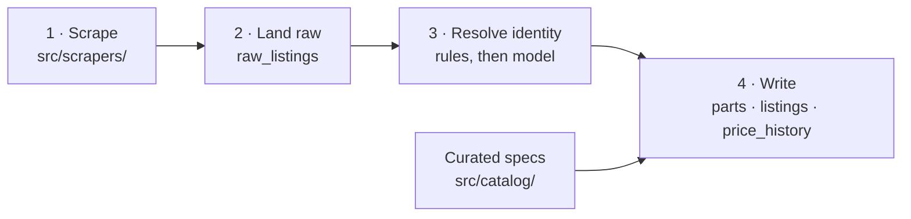

# The data pipeline

Four stages, two jobs, one direction. Nothing in the web app writes; nothing in
the pipeline serves a request.



Stages 1–2 are `npm run scrape`; stages 3–4 are `npm run normalize`. They are
separate jobs on separate schedules so that one retailer failing does not stop
the rest of the night's rows being processed.

---

## Stage 1 — Scrape

`src/scrapers/*` → `ScrapedRow[]`

One module per retailer. A scraper is deliberately dumb: it does no part
matching, no spec parsing and no unit conversion. Anything the page offers that
might help later goes into `payload` verbatim.

```ts
type ScrapedRow = {
  shop: string
  sourceUrl: string
  rawTitle: string
  rawPriceText: string | null
  payload: {
    category: Category          // our canonical category
    retailerCategory: string    // their label, kept to debug bad mappings
    externalId?: string | null
    brand?: string | null
    priceLkr?: number | null
    pricesByMethod?: Record<string, number>   // Tyno sites price per payment method
    listPriceLkr?: number | null
    inStock?: boolean | null
    preOrder?: boolean | null
    imageUrl?: string | null
    specs?: Record<string, string>            // manufacturer spec table, when present
  }
}
```

All six sites are reachable with plain `fetch` — no headless browser. Four are
parsed from HTML; pcbuilders.lk is read from a JSON API and winsoft.lk from
JSON-LD on each product page. Per-site mechanics, selectors and gotchas are in
[retailers.md](retailers.md).

**Politeness.** Every request goes through `src/lib/http.ts`, which serialises
requests per host with a minimum 1.5s gap, sets a bot user-agent naming the
repo, applies a timeout and bounded retries, and returns non-2xx rather than
throwing so a single 404 does not kill a run. **Do not parallelise requests to
one retailer.**

**Sanity gate.** Before anything is written, `assertPlausible` throws if:

| Condition | Why it is fatal |
|---|---|
| zero rows | Every tracked shop has hundreds of products. Zero means blocked or moved. |
| no row has a price | The layout has probably changed. |
| >50% implausible titles | A title selector matching the wrong node yields rows that look fine by count and are useless. |

### Running it

```bash
npm run scrape -- all
```

```bash
npm run scrape -- nanotek.lk --categories gpu,psu
```

```bash
npm run scrape -- gamestreet.lk --dry-run --max-products 5
```

Flags: `--categories`, `--max-pages`, `--max-products`, `--dry-run`. Shops run in
sequence and failures are collected rather than aborting the batch; the process
exits non-zero if any failed.

---

## Stage 2 — Land raw

`raw_listings` is append-only and never mutated except to stamp `normalized_at`.
This is what makes the rest reprocessable: a normalization bug is fixed and
re-run against the rows already on disk, without touching a retailer.

---

## Stage 3 — Resolve identity

For each unprocessed raw row:

1. **Deterministic extraction** (`src/normalize/extract.ts`). Category-specific
   rules parse brand, model and the specs implied by the title, and synthesise a
   `part_id`. Returning `null` is a valid answer — retailer categories are not
   trustworthy (a motherboard sits in one shop's GPU listing, a UPS in another's
   power-supply listing), so anything that does not look like the claimed
   category falls through rather than being forced into it.

2. **Canonicalisation.** `canonicalPartId` folds known aliases; `isImpossibleGpu`
   drops extractions the curated catalog can prove wrong (a memory capacity that
   chip never shipped in), so they fall to the next step instead of minting a
   part for a card that does not exist.

3. **Model fallback** (`src/normalize/ai.ts`), only for `gpu` and `psu`, only
   when a key is configured, and only for rows step 1 returned `null` for. The
   model is handed the title and a list of same-category candidates and asked to
   pick one or decline. Only `confidence: 'high'` is accepted; everything else
   is treated as no match. Every accepted match is logged with its reason — the
   run log is the audit trail for the only rows in the system a model decided.

4. **Price gate.** A price below 1,000 LKR is a placeholder, not a price. Those
   rows are marked processed and skipped.

Rows that resolve to nothing are still stamped `normalized_at`, so the next run
does not reconsider titles that will never resolve.

---

## Stage 4 — Write

In order:

1. **`parts`** — insert newly discovered parts (`onConflictDoNothing`).
2. **Spec patches** — fold in whatever spec tables this run published. Patches
   are *merged*, not replaced, resolving toward the more demanding value.
   > A bug here: because `vramGb` was always non-null, a partial patch clobbered
   > good `Recommended PSU` values that an earlier row had contributed.
3. **`listings`** — one row per `(part_id, shop)`, upserted. Where a shop lists
   the same canonical part several times, a row you can buy beats a cheaper one
   you cannot; among equals, the cheapest wins.
4. **`price_history`** — one row per `(part_id, shop, day)`, upserted, so
   re-running on the same day refreshes that day's price rather than adding a
   duplicate. That is what keeps a trend line one point per day.
5. **`raw_listings.normalized_at`** — stamped for every row considered.
6. **Curated specs applied last**, so they overwrite anything a retailer's spec
   table contributed during this run.

### Running it

```bash
npm run normalize
```

```bash
npm run normalize -- --redo --dry-run
```

Flags: `--limit N` (default 5000 rows), `--redo` (reprocess already-normalized
rows), `--no-ai` (skip the model even when a key is set), `--dry-run`.

The run prints three summary lines, which the CI job greps into the workflow
summary:

```
resolved <N> by rule, <N> by model, <N> unmatched, <N> without a usable price
wrote <N> new parts, <N> listings, <N> price-history rows
curated catalog: <N>/<N> entries applied
```

---

## Schedule

All times UTC; Sri Lanka is UTC+5:30.

| Workflow | Cron | Local time | Timeout |
|---|---|---|---|
| `scrape-winsoft.yml` | `30 18 * * *` | 00:00 | 30 min |
| `scrape-nanotek.yml` | `0 19 * * *` | 00:30 | 90 min |
| `scrape-redlinetech.yml` | `30 19 * * *` | 01:00 | 45 min |
| `scrape-gamestreet.yml` | `0 20 * * *` | 01:30 | 20 min |
| `scrape-chamacomputers.yml` | `30 20 * * *` | 02:00 | 30 min |
| `scrape-pcbuilders.yml` | `0 21 * * *` | 02:30 | 20 min |
| `normalize.yml` | `30 21 * * *` | 03:00 | 30 min |

Each caller passes its shop key into the reusable `scrape.yml`. Runs are
staggered so the shops are never hit at once, and each has a `concurrency`
group so two runs for the same shop never overlap.

All seven are `workflow_dispatch`-able for a manual run.

**Secrets** come from repository secrets (`DATABASE_URL`, `ANTHROPIC_API_KEY`)
and are checked *before* the network is touched — otherwise a run would scrape a
retailer in full and only then discover it has nowhere to put the rows, having
spent someone else's bandwidth for nothing. A missing `ANTHROPIC_API_KEY` is a
warning, not an error: it degrades the run rather than breaking it.

> **Known gap.** The four oldest callers pass
> `categories: gpu,psu,cpu,motherboard,ram`. `storage` and `case` are **not** in
> their nightly runs, so for those shops the two categories are only as fresh as
> the last manual run. `scrape-pcbuilders.yml` passes all seven — a category
> costs it one API request rather than one request per product, and
> `scrape-winsoft.yml` passes all seven because narrowing them would not shorten
> its run either way.

---

## Failure modes and what they look like

| Symptom | Likely cause | Where to look |
|---|---|---|
| Run fails with "returned no rows at all" | Shop is blocking us, or its structure changed | HTTP status codes in the run log; [retailers.md](retailers.md) |
| Run fails with "implausible titles" | A title selector now matches the wrong node | The example title in the error |
| Row count fine, prices all null | Price endpoint or selector changed | `parsePrice` for that retailer |
| A part appears twice at different prices | `part_id` is too fine — a distinguishing field is missing or spelled differently | [decisions.md](decisions.md#part-identity) |
| Two different parts share one entry | `part_id` is too coarse | same |
| Many "no match" lines for one category | An extractor stopped recognising a title pattern | `src/normalize/extract.ts` |
| Site shows stale prices after a run | Nothing invalidates the `catalog` cache tag; up to 30 minutes | `src/queries/build.ts` |

## Invariants worth preserving

- Scrapers never resolve parts. Normalizers never fetch from a retailer.
- `raw_listings` is never edited.
- The same title always produces the same `part_id`.
- Every model-decided match is logged.
- A curated spec beats a scraped one; a scraped one beats an inferred one;
  nothing is guessed.
